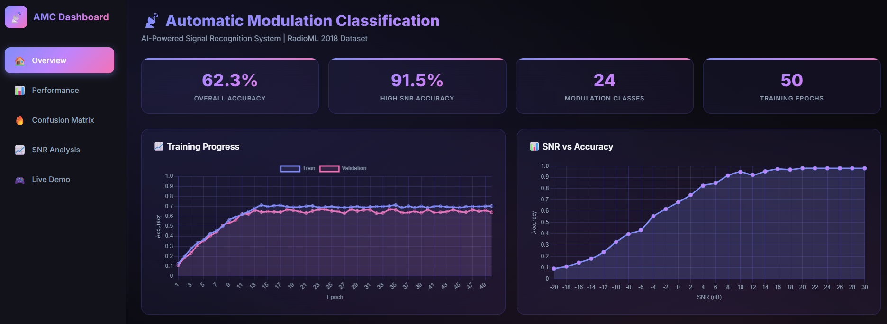

# 📡 Automatic Modulation Classification (AMC)

AI-powered system for classifying radio signal modulation types using Deep Learning.


## 🎯 Overview

This project implements an **Automatic Modulation Classification** system using Convolutional Neural Networks (CNNs). It can recognize **24 different modulation types** from raw I/Q signal samples.

### Supported Modulations

| Category | Types |
|----------|-------|
| **PSK** | BPSK, QPSK, 8PSK, 16PSK, 32PSK, OQPSK |
| **QAM** | 16QAM, 32QAM, 64QAM, 128QAM, 256QAM |
| **APSK** | 16APSK, 32APSK, 64APSK, 128APSK |
| **ASK** | OOK, 4ASK, 8ASK |
| **Analog** | AM-SSB-WC, AM-SSB-SC, AM-DSB-WC, AM-DSB-SC, FM, GMSK |

## 📸 Dashboard Preview


## 📁 Project Structure

```
New Project/
├── archive/                          # Dataset
│   └── GOLD_XYZ_OSC.0001_1024.hdf5  # RadioML 2018 (~3GB)
├── src/
│   ├── data_loader.py               # Data loading & preprocessing
│   ├── model.py                     # CNN/ResNet architecture
│   ├── train.py                     # Training pipeline
│   ├── evaluate.py                  # Evaluation & metrics
│   └── utils.py                     # Logging utilities
├── app/
│   └── app.py                       # Streamlit dashboard
├── scripts/
│   └── generate_demo_data.py        # Generate synthetic test data
├── models/                          # Saved trained models
├── results/                         # Evaluation results
├── tests/                           # Unit tests
│   └── test_amc.py                 # Test suite
├── logs/                            # Training logs & TensorBoard
├── config.yaml                      # Project configuration
├── requirements.txt                 # Dependencies (pinned versions)
├── Dockerfile                       # Docker containerization
├── docker-compose.yml               # Multi-container setup
├── .env.example                     # Environment variables template
└── README.md                        # This file
```


## 🚀 Quick Start

### 1. Install Dependencies

```bash
pip install -r requirements.txt
```

### 2. Train Model (Quick Test)

```bash
python src/train.py --quick
```

### 3. Full Training

```bash
# Standard training
python src/train.py --epochs 50 --model cnn

# With mixed precision (faster on compatible GPUs)
python src/train.py --epochs 50 --model cnn --mixed-precision

# Train ResNet model
python src/train.py --epochs 50 --model resnet
```

### 4. Evaluate Model

```bash
python src/evaluate.py --model models/amc_cnn_XXXXXX.keras
```

### 5. Launch Dashboard

```bash
streamlit run app/app.py
```

### 6. Run Tests

```bash
pytest tests/ -v
```

## 🧠 Model Architecture

### CNN Model
```
Input (1024, 2) → I/Q samples
│
├─ Conv1D(64, 8) + BN + ReLU + MaxPool
├─ Conv1D(128, 4) + BN + ReLU + MaxPool
├─ Conv1D(256, 4) + BN + ReLU + MaxPool
├─ Conv1D(256, 4) + BN + ReLU + GlobalAvgPool
│
├─ Dense(256) + ReLU + Dropout(0.5)
├─ Dense(128) + ReLU + Dropout(0.5)
└─ Dense(24, softmax) → 24 classes
```

### ResNet Model
- Initial Conv1D(64, 7) + BN + ReLU + MaxPool
- 3 Residual blocks with skip connections (64 → 128 → 256 filters)
- GlobalAvgPool + Dense(256) + Dense(24)

## 📊 Expected Performance

| SNR Range | Accuracy |
|-----------|----------|
| Overall | ~55-65% |
| High SNR (≥10 dB) | ~90%+ |
| Low SNR (<0 dB) | ~20-40% |

## 🖥️ Dashboard Features

- **Overview**: Key metrics and training progress
- **Performance**: Loss and accuracy curves
- **Confusion Matrix**: Interactive heatmap
- **SNR Analysis**: Accuracy vs SNR visualization
- **Live Demo**: Generate signals and see predictions
- **Model Selection**: Choose from trained models
- **History Viewer**: Compare training runs

## ⚡ Features

- ✅ CNN and ResNet architectures
- ✅ Mixed precision training support
- ✅ TensorBoard integration
- ✅ Comprehensive logging system
- ✅ Custom error handling
- ✅ Unit test suite
- ✅ Interactive Streamlit dashboard
- ✅ Model selection and comparison
- ✅ Per-SNR accuracy analysis

## 📚 Dataset

This project uses the **RadioML 2018.01A** dataset:
- **Samples**: ~2.5 million
- **Signal Length**: 1024 I/Q samples
- **SNR Range**: -20 dB to +30 dB
- **Classes**: 24 modulation types

Download from: https://www.deepsig.ai/datasets

## 🧪 Testing

Run the test suite:

```bash
# Run all tests
pytest tests/ -v

# Run with coverage
pytest tests/ --cov=src --cov-report=html
```

## 📝 License

This project is for educational purposes.

---

## 🐳 Docker Support

### Build and Run with Docker

```bash
# Build Docker image
docker build -t amc-project .

# Run dashboard
docker run -p 8501:8501 amc-project

# Run training (with GPU)
docker-compose up train

# Run dashboard service
docker-compose up dashboard
```

### Generate Demo Data

If you don't have the full RadioML dataset, generate synthetic demo data:

```bash
# Generate demo dataset (~60MB)
python scripts/generate_demo_data.py

# Custom options
python scripts/generate_demo_data.py --samples 200 --output archive/demo_data.hdf5
```

## ⚙️ Configuration

All hyperparameters are in `config.yaml`:

```yaml
training:
  epochs: 50
  batch_size: 256
  learning_rate: 0.001
  mixed_precision: false
```

---

Built with ❤️ using TensorFlow & Streamlit

## 📝 Author
- **Rapeenut** - Telecommunication Engineering Student @King Mongkut's University of Technology Thonburi


